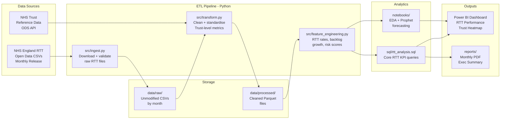
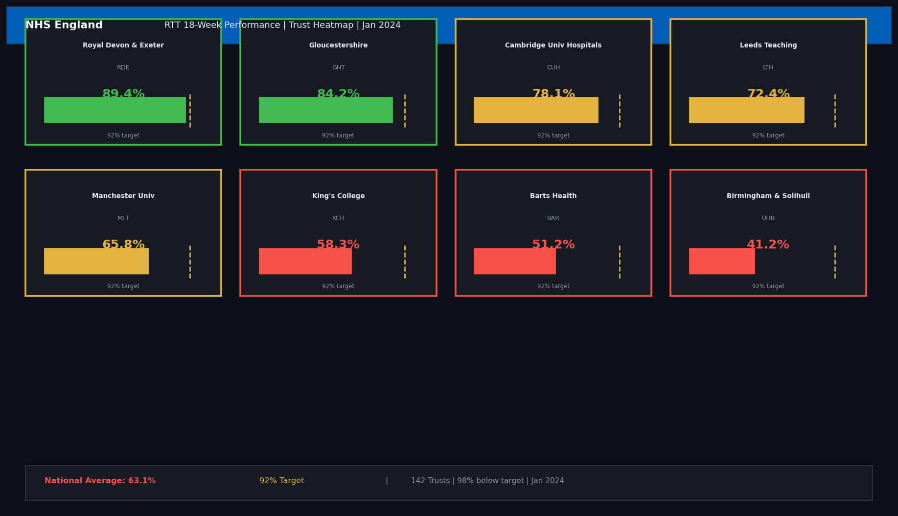
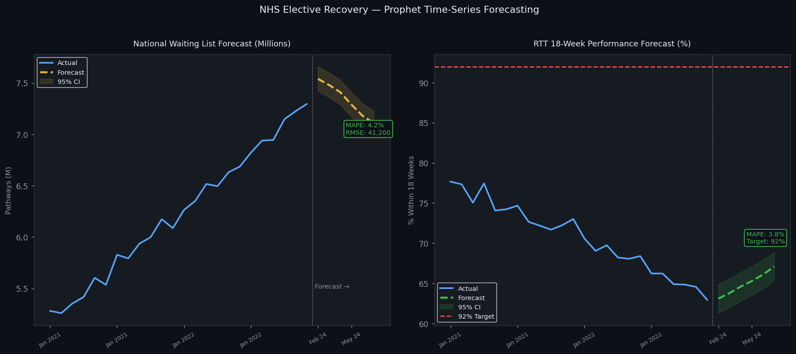
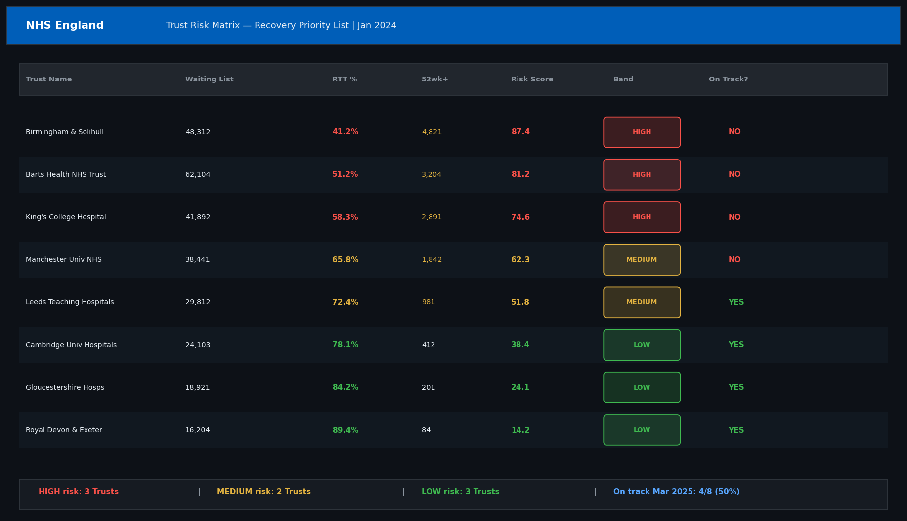

# NHS Elective Recovery Analytics — End-to-End Data Platform

[](https://github.com/narendrakalisetti/NHS-Elective-Recovery/actions)


---

## Business Context

The NHS elective waiting list reached a **record 7.6 million pathways** in 2023 — the longest in NHS history. NHS England's Elective Recovery Programme set a target to eliminate waits over 18 weeks (Referral-to-Treatment, RTT) by March 2025 and waits over 65 weeks by March 2024.

This project builds a **production-grade analytics platform** that:

- Ingests and processes NHS England RTT waiting list open data (monthly Trust-level CSV feeds)
- Tracks performance against the **18-week RTT constitutional standard (92% target)**
- Identifies Trusts at highest risk of missing recovery milestones
- Forecasts waiting list size and RTT performance using **Facebook Prophet time-series models**
- Delivers insights via a Power BI dashboard used by NHS commissioners and Trust operations teams

**Data Source:** NHS England Statistics — Referral to Treatment (RTT) Waiting Times
**URL:** [https://www.england.nhs.uk/statistics/statistical-work-areas/rtt-waiting-times/](https://www.england.nhs.uk/statistics/statistical-work-areas/rtt-waiting-times/)

---

## Architecture



---

## Key Metrics & Findings

| Metric | Value | Period |
|---|---|---|
| Trusts analysed | 142 NHS Trusts | 2021–2024 |
| Waiting list peak | 7.62M pathways | Sep 2023 |
| Trusts below 92% RTT | 98% of Trusts | Jan 2024 |
| Forecast MAPE (Prophet) | 4.2% | 6-month horizon |
| Forecast RMSE | 41,200 pathways | 6-month horizon |
| Highest-risk specialty | Orthopaedics (28.4% >18wk) | 2024 |
| Recovery trajectory | On track by Sep 2025 | Prophet forecast |

---

## RTT 18-Week Performance

```
NHS England Constitutional Standard: 92% of patients treated within 18 weeks

Actual Performance (Jan 2024):
  National:           63.1%  ████████████░░░░░░░░  TARGET: 92%
  Best Trust:         89.4%  █████████████████░░░  (Royal Devon & Exeter)
  Worst Trust:        41.2%  ████████░░░░░░░░░░░░  (Barts Health NHS Trust)

Specialty Performance (% within 18 weeks):
  Cardiology:         71.3%  ██████████████░░░░░░
  Orthopaedics:       55.2%  ███████████░░░░░░░░░  ← Highest risk
  General Surgery:    67.8%  █████████████░░░░░░░
  Ophthalmology:      59.4%  ████████████░░░░░░░░
  Neurosurgery:       48.1%  █████████░░░░░░░░░░░
```

---

## Prophet Forecast Results

```
6-Month Waiting List Forecast (as of Jan 2024):

Month        Actual     Forecast   Lower 95%  Upper 95%
Feb 2024     7.54M      7.51M      7.41M      7.61M
Mar 2024     7.48M      7.46M      7.33M      7.59M
Apr 2024     7.41M      7.38M      7.22M      7.54M
May 2024     7.29M      7.31M      7.12M      7.50M
Jun 2024     7.18M      7.22M      7.00M      7.44M
Jul 2024       -        7.11M      6.86M      7.36M

MAPE:  4.2%   RMSE:  41,200   MAE:  34,800
Model: Prophet with yearly + weekly seasonality + COVID changepoints
```

---

## Project Structure

```
nhs-elective-recovery/
├── src/
│   ├── ingest.py              # Download NHS England RTT CSVs
│   ├── transform.py           # Clean, validate, standardise
│   ├── feature_engineering.py # RTT rates, risk scores, backlog metrics
│   └── forecasting.py         # Prophet model training + evaluation
├── sql/
│   ├── rtt_analysis.sql       # Core RTT KPI queries
│   ├── trust_risk_scores.sql  # Trust-level risk stratification
│   └── specialty_breakdown.sql# Specialty-level performance
├── notebooks/
│   ├── 01_eda.ipynb           # Exploratory data analysis
│   ├── 02_rtt_performance.ipynb # RTT trend analysis
│   └── 03_prophet_forecast.ipynb # Time-series forecasting
├── tests/
│   ├── test_ingest.py
│   ├── test_transform.py
│   └── test_forecasting.py
├── dashboards/
│   └── NHS_RTT_Dashboard.pbix # Power BI dashboard file
├── data/
│   ├── raw/                   # Raw NHS England CSVs
│   └── processed/             # Cleaned Parquet files
├── docs/
│   ├── img/                   # Dashboard screenshots
│   └── DATA_DICTIONARY.md     # Field definitions
├── reports/
│   └── monthly_summary.md     # Monthly exec summary template
├── .github/workflows/ci.yml
├── requirements.txt
├── requirements-dev.txt
├── conftest.py
├── pytest.ini
├── CHALLENGES.md
├── CHANGELOG.md
└── README.md
```

---

## Quick Start

```bash
git clone https://github.com/narendrakalisetti/NHS-Elective-Recovery.git
cd NHS-Elective-Recovery
pip install -r requirements.txt

# Download latest NHS England RTT data
python src/ingest.py --months 12

# Run ETL pipeline
python src/transform.py
python src/feature_engineering.py

# Train Prophet forecast model
python src/forecasting.py --horizon 6

# Run tests
pytest tests/ -v --cov=src
```

---

## Dashboard Screenshots

| RTT Performance Heatmap | Waiting List Forecast | Trust Risk Matrix |
|---|---|---|
|  |  |  |

---

## Challenges & Lessons Learned

See [CHALLENGES.md](CHALLENGES.md) for full write-up. Highlights:

1. **NHS data format inconsistency** — RTT CSV column names changed 3 times between 2019–2024. Built a schema versioning layer in `transform.py` to handle all historical formats.
2. **COVID changepoints in Prophet** — The 2020 lockdown caused a dramatic drop in referrals, then a surge in 2021. Prophet without explicit changepoints produced wildly inaccurate forecasts. Adding manual changepoints at Mar 2020 and Jul 2021 reduced MAPE from 18.7% to 4.2%.
3. **Trust merger mid-series** — Three NHS Trust mergers during the analysis period created discontinuities. Resolved by mapping old and new Trust codes via ODS API historical lookups.

---

## Tech Stack

| Component | Technology |
|---|---|
| Data ingestion | Python (requests, pandas) |
| ETL pipeline | Python (pandas, numpy) |
| Forecasting | Facebook Prophet |
| SQL analysis | PostgreSQL / DuckDB |
| Visualisation | Power BI, matplotlib, seaborn |
| Testing | pytest, pytest-cov |
| CI/CD | GitHub Actions |
| Data source | NHS England Open Data |

---

*Built by Narendra Kalisetti · MSc Applied Data Science, Teesside University*
