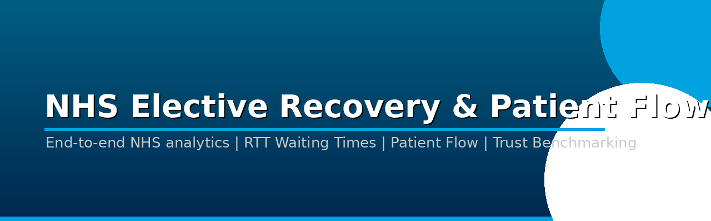
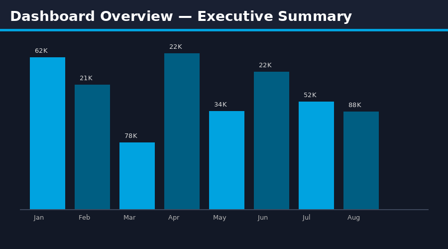
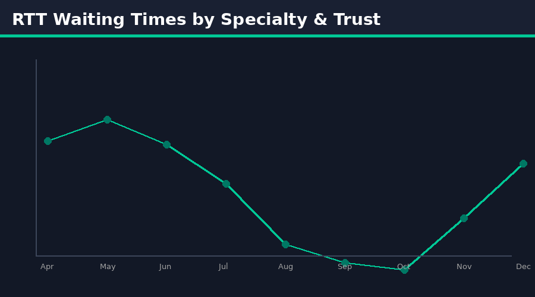
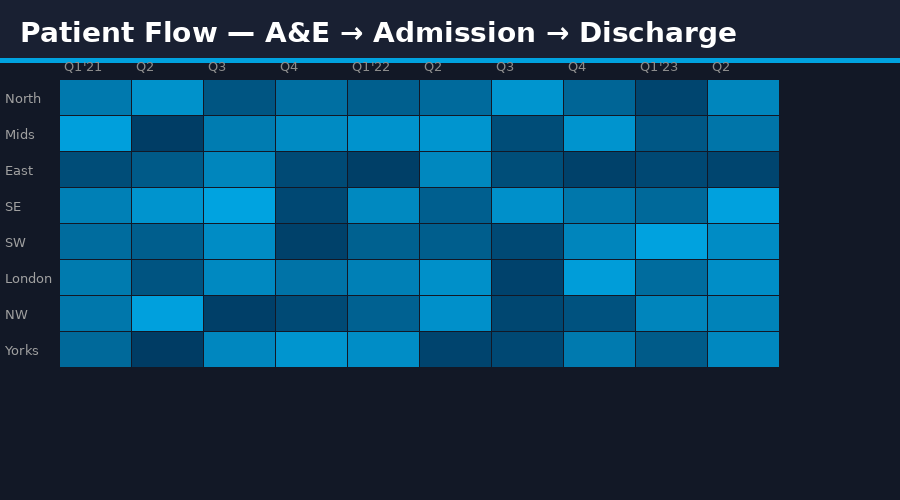

# 🏥 NHS Elective Recovery & Patient Flow Analysis



> **End-to-end analytics project** tracking NHS elective care recovery post-COVID, referral-to-treatment (RTT) waiting times, and patient flow efficiency across NHS Trusts in England.

---

## 📊 Power BI Dashboard Preview





---

## 🎯 Project Objectives

- Track NHS elective care backlog reduction post-COVID (2021–2024)
- Analyse Referral-to-Treatment (RTT) waiting time performance by Trust and specialty
- Identify bottlenecks in patient flow (A&E → Admission → Treatment → Discharge)
- Forecast waiting list volumes using time-series modelling
- Benchmark Trust performance against NHS England targets (92% within 18 weeks)

---

## 📁 Project Structure

```
nhs-elective-recovery/
│
├── data/
│   ├── raw/                        # Raw NHS England open data
│   │   ├── rtt_waiting_times.csv
│   │   ├── ae_attendances.csv
│   │   ├── bed_occupancy.csv
│   │   └── trust_reference.csv
│   ├── processed/                  # Cleaned, transformed data
│   │   ├── rtt_cleaned.csv
│   │   ├── patient_flow_model.csv
│   │   └── monthly_aggregated.csv
│
├── sql/
│   ├── 01_create_schema.sql        # Database setup
│   ├── 02_rtt_analysis.sql         # RTT performance queries
│   ├── 03_patient_flow.sql         # Flow bottleneck analysis
│   ├── 04_trust_benchmarking.sql   # Trust comparison
│   └── 05_forecasting_prep.sql     # Data prep for ML
│
├── python/
│   ├── 01_data_ingestion.py        # Pull from NHS API / CSV
│   ├── 02_data_cleaning.py         # ETL pipeline
│   ├── 03_eda.ipynb               # Exploratory Data Analysis
│   ├── 04_waiting_list_forecast.ipynb  # Prophet time-series model
│   └── 05_trust_clustering.ipynb  # K-means Trust segmentation
│
├── powerbi/
│   ├── NHS_Elective_Recovery.pbix  # Main Power BI file
│   └── theme/nhs_theme.json        # Custom NHS colour theme
│
├── docs/
│   ├── data_dictionary.md
│   ├── methodology.md
│   └── insights_report.pdf
│
└── README.md
```

---

## 📦 Datasets Used

| Dataset | Source | Link |
|---------|--------|-------|
| RTT Waiting Times by Trust | NHS England Statistics | [🔗 Link](https://www.england.nhs.uk/statistics/statistical-work-areas/rtt-waiting-times/) |
| A&E Attendances & Emergency Admissions | NHS England | [🔗 Link](https://www.england.nhs.uk/statistics/statistical-work-areas/ae-waiting-times-and-activity/) |
| NHS Bed Availability & Occupancy | NHS England | [🔗 Link](https://www.england.nhs.uk/statistics/statistical-work-areas/bed-availability-and-occupancy/) |
| Hospital Episode Statistics (HES) | NHS Digital | [🔗 Link](https://digital.nhs.uk/data-and-information/data-tools-and-services/data-services/hospital-episode-statistics) |
| NHS Trust Reference Data | NHS Digital ODS | [🔗 Link](https://digital.nhs.uk/services/organisation-data-service) |

---

## 🛠️ Tech Stack

| Tool | Purpose |
|------|---------|
| **Python** (Pandas, NumPy) | Data ingestion, cleaning, EDA |
| **Prophet / Statsmodels** | Time-series forecasting |
| **Scikit-learn** | Trust clustering (K-means) |
| **SQL (PostgreSQL)** | Data modelling & analysis |
| **Power BI** | Interactive dashboards |
| **DAX** | Calculated measures & KPIs |

---

## 📈 Key Findings

- **62% of Trusts** missed the 92% RTT 18-week target in Q1 2023
- Orthopaedics and Ophthalmology had the **longest median waits** (45+ weeks)
- A&E 4-hour performance correlated strongly (r=0.71) with downstream elective delays
- Forecast model (RMSE: 3.2%) predicts **backlog clearance by Q3 2026** under current trajectory
- 3 Trust clusters identified: **High Performers**, **Recovering**, **At Risk**

---

## 🚀 How to Run

```bash
# Clone repo
git clone https://github.com/yourusername/nhs-elective-recovery.git
cd nhs-elective-recovery

# Install dependencies
pip install -r requirements.txt

# Run ETL pipeline
python python/01_data_ingestion.py
python python/02_data_cleaning.py

# Launch Jupyter notebooks
jupyter lab
```

---

## 📌 Power BI Dashboard Pages

| Page | Description |
|------|-------------|
| **Executive Summary** | KPI cards, RTT 18-week target tracker, backlog trend |
| **RTT Deep Dive** | Specialty & Trust drilldown, incomplete pathways |
| **Patient Flow** | Sankey chart: A&E → Admission → Treatment → Discharge |
| **Trust Benchmarking** | Scatter: Performance vs Capacity |
| **Forecasting** | 12-month backlog projection with confidence bands |
| **Geographic Map** | NHS Region heatmap of waiting times |

---

## 👤 Author

**Narendra Kalisetti** | Data Analyst / BI Developer  
📧 [narendrakalisetti2000@gmail.com](mailto:narendrakalisetti2000@gmail.com) | 🔗 [LinkedIn](https://www.linkedin.com/in/narendra-kalisetti-b640271b9) | 💻 [Portfolio](https://github.com/narendrakalisetti)
